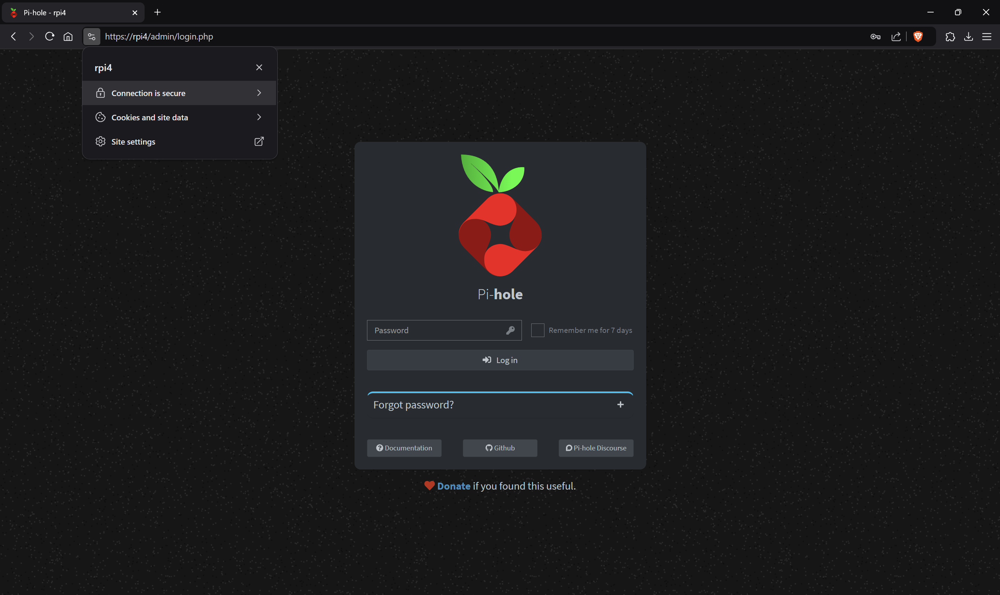

# Pi-hole HTTPS Setup 🔒

This repository automates the setup of a secure HTTPS connection for your Pi-hole server, including automatic detection and support for Tailscale. It supports both older Pi-hole versions (using Lighttpd) and Pi-hole 6.0+ (using the built-in FTL webserver).

## Features 🌟
- **Automatically** generates SSL certificates and configures your Pi-hole for HTTPS.
- Detects **Tailscale** setup and includes it in the SSL configuration.
- Supports **both Lighttpd (pre-6.0) and FTL webserver (6.0+)**.
- Certificate works seamlessly with **Windows, Linux, Android, MacOS, and iOS**.
- Simplifies the process with a **single command**.

---

## Single Command Setup ✅

Secure your Pi-hole with HTTPS in just **one simple command**:

```bash
curl -fsSL https://raw.githubusercontent.com/luizbizzio/pihole-https/main/pihole-https.sh | sudo bash
```

### What Happens Next? 🚀
- 🛠 **No manual setup needed**: The script detects your environment and applies the SSL certificate.
- 🌐 **Supports Tailscale**: If Tailscale is installed, it will include its DNS in the SSL configuration.
- 🔒 **HTTPS applied**: Your Pi-hole admin interface will be secured with HTTPS.
- ⚡ **Supports both Pi-hole 6.0+ and older versions**: Automatically detects whether to configure Lighttpd or FTL webserver.

---

## Result Preview 🏞️

Here’s how your Pi-hole interface will look with HTTPS enabled and a valid certificate:



---

## How It Works 🛠️

1. **Hostname and IP Detection**:
   - Detects your Pi-hole's hostname and IP addresses automatically.
   - If Tailscale is installed, it also includes the Tailscale DNS in the SSL configuration.

2. **SSL Certificate Generation**:
   - Creates an SSL certificate for your Pi-hole server, valid for 10 years.

3. **Webserver Configuration**:
   - If Pi-hole **pre-6.0** is detected, Lighttpd is configured for HTTPS.
   - If Pi-hole **6.0+** is detected, the new built-in FTL webserver is configured for HTTPS.

4. **Certificate Accessibility**:
   - The certificate is saved locally and ready for use on all major platforms.

---

## Installing the Certificate on Devices 📱💻

Once the script completes, you'll need to install the certificate on your devices for secure access.

### Windows 🪟
1. Download the certificate file.
2. Open the certificate by double-clicking it.
3. Click **Install Certificate**, choose **Local Machine**, and proceed.
4. Select **Trusted Root Certification Authorities** and complete the wizard.
5. Restart your browser or application to apply the changes.

### Linux 🐧
1. Copy the certificate to `/usr/local/share/ca-certificates/`.
2. Rename the file with a `.crt` extension if necessary.
3. Run:
   ```bash
   sudo update-ca-certificates
   ```
4. Restart your browser or application to apply the changes.

### Android 📱
1. Download the certificate file to your device.
2. Go to **Settings** > **Security** > **More security & Privacy** > **Install a Certificate**.
3. Select the file and follow the instructions.
4. Restart your browser or application to apply the changes.

### MacOS 🍏
1. Download the certificate file.
2. Open **Keychain Access**.
3. Drag the certificate into the **System** keychain.
4. Right-click the certificate, select **Get Info**, and set **Trust** to **Always Trust**.
5. Restart your browser or application to apply the changes.

### iOS 📱
1. Download the `.crt` file to your iPhone or iPad.
2. Open the **Settings** app.
3. Go to **General** > **VPN & Device Management** > **Certificate**.
4. Select the certificate file from your Downloads.
5. Install the certificate and confirm when prompted.
6. After installation, go to **Settings** > **General** > **About** > **Certificate Trust Settings**.
7. Enable trust for your new certificate.
8. Restart your browser or application to apply the changes.

---

## Notes 📝
- The script automatically detects whether **Lighttpd (pre-6.0)** or **FTL webserver (6.0+)** is in use and configures HTTPS accordingly.
- The script skips Tailscale detection if it is not installed.
- Compatible with most major browsers and operating systems.
- Not compatible with Docker. ⚠️

---

## License 📝
This repository is licensed under the [MIT License](./LICENSE).

Enjoy secure Pi-hole browsing! 🔒
